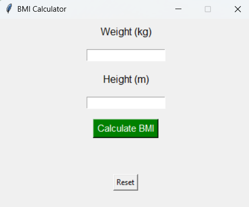
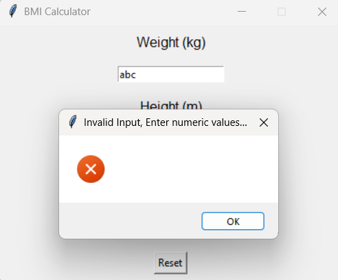
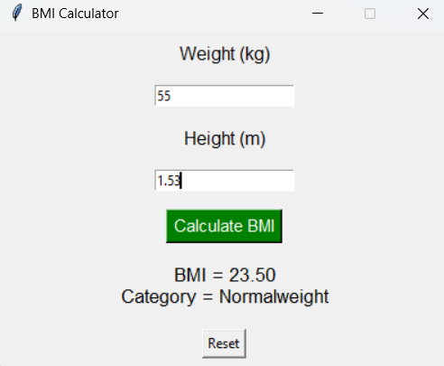
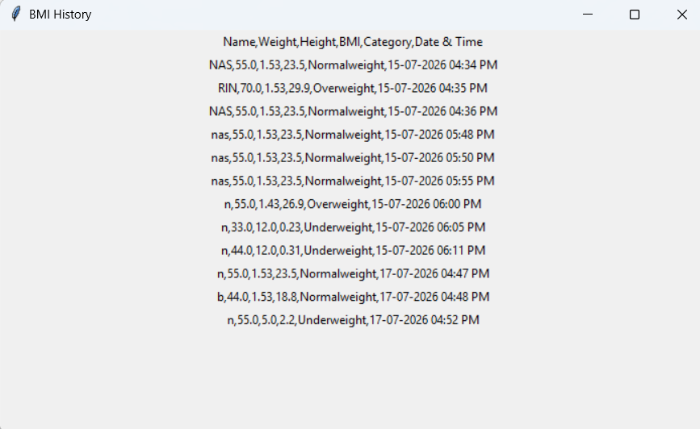
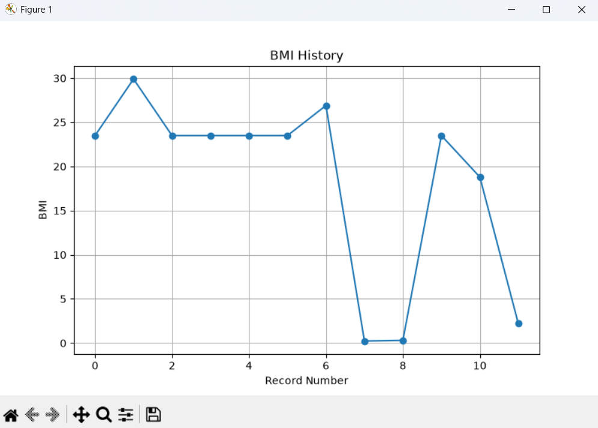

# 🧮 BMI Calculator

A Python-based BMI (Body Mass Index) Calculator developed using **Tkinter** for the graphical user interface. The application calculates BMI, classifies the health category, stores records in a CSV file, displays BMI history, and visualizes BMI trends using Matplotlib.

## ✨ Features

- Calculate BMI using weight and height
- Display BMI category (Underweight, Normal Weight, Overweight, Obese)
- User-friendly Tkinter GUI
- Input validation with error messages
- Reset button to clear inputs
- Save BMI records to a CSV file
- View previously saved BMI history
- Visualize BMI records using a graph
- Color-coded BMI results
- Automatic timestamp for each record

## 🛠 Technologies Used

- Python
- Tkinter
- CSV
- Matplotlib
- Datetime
- OS Module

## 📂 Project Structure

```
Python-Task2-BMICalculator/
│
├── bmi_calculator.py
├── bmi_gui.py
├── bmi_data.csv
├── README.md
└── screenshots/
    ├── home.png
    ├── error.png
    ├── result.png
    ├── history.png
    └── graph.png
```

## 📸 Screenshots

### Home Screen



### Error Validation



### BMI Result



### BMI History



### BMI Graph



## ▶️ How to Run

1. Clone the repository.
2. Install Python 3.
3. Install Matplotlib if not already installed:

```
pip install matplotlib
```

4. Run the application:

```
python bmi_gui.py
```

## 👩‍💻 Author

**Nasrin A**
