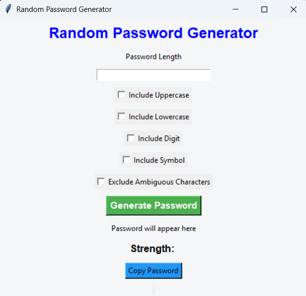
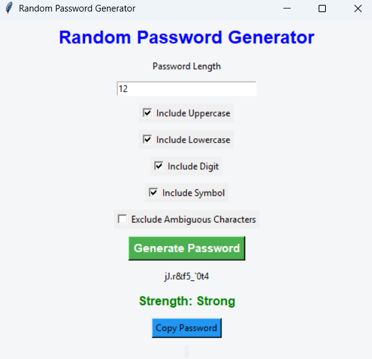
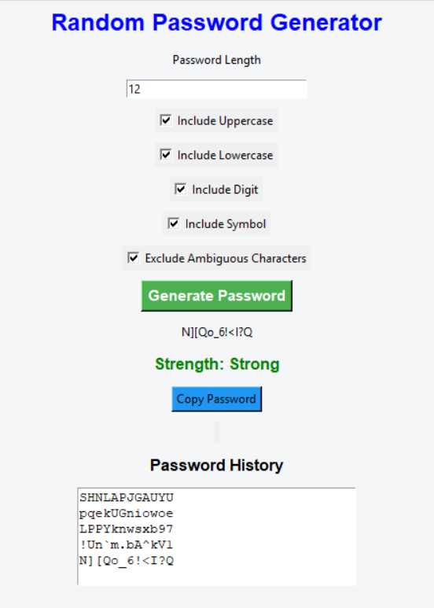
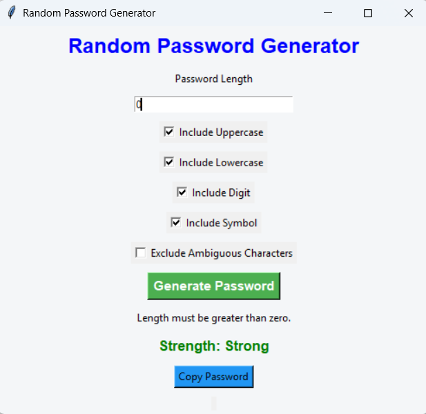

# Random Password Generator 🔐

## 📌 Description
The Random Password Generator is a Python application that generates strong and secure passwords based on the user-specified password length.

This project was developed as **Task 3** for the **Oasis Infobyte Python Programming Internship**.

---

## ✨ Features

- Generate secure random passwords
- User-friendly GUI using Tkinter
- Console version included
- Supports customizable password length
- Quick and easy to use

---

## 🛠️ Technologies Used

- Python 3
- Tkinter
- Random Module

---

## 📂 Project Structure

```
Python-Task3-RandomPasswordGenerator
│── password_generator_console.py
│── password_generator_gui.py
│── README.md
└── screenshots
    ├── home.png
    ├── password.png
    ├── history.png
    └── error.png
```

---

## 🚀 How to Run

### GUI Version

```bash
python password_generator_gui.py
```

### Console Version

```bash
python password_generator_console.py
```

---

## 📸 Screenshots

### Home Screen



### Generated Password



### Password History



### Error Validation



---

## 📖 Internship

This project was completed as part of the **Oasis Infobyte Python Programming Internship**.

---

## 👩‍💻 Author

**Nasrin A**

GitHub: https://github.com/Nasrin-Code
